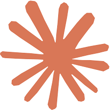

# Multi-Agent Architecture Studio

> **Design before you build. Question before you decide.**



A local, offline-first design studio that turns a rough idea into three rigorously stress-tested multi-agent architectures — through a pipeline of specialized AI interrogators that refuse to let you ship a bad design.

---

## What it is

Most teams reach for a framework and start wiring agents together before anyone has answered the hard questions: *Who owns the state? What happens when the LLM hallucinates a tool call? Why does this need three agents instead of one?*

This studio forces those questions first.

You describe a use case in natural language. A chain of specialized subagents interrogates your assumptions — one by one, topic by topic — and the conversation crystallizes into a structured architecture JSON. That JSON is immediately rendered as an interactive React Flow diagram with layers, bridges, and cinematic transitions between three design variants: **Basic**, **Intermediate**, and **Advanced**.

No framework lock-in. No generated code. Just the blueprint.

---

## How it works

```
Your idea
   │
   ▼
case-intake          Normalizes the problem: title, actors, constraints, volume
   │
   ▼
complexity-assessor  Scores complexity across 5 axes. Verdict is binding.
   │
   ▼
agent-decomposer     Proposes the minimum viable agent set. Earns every agent.
   │
   ▼
tool-designer        Defines tools per agent. Flags bridges for heavy payloads.
   │
   ▼
execution-mode-designer  Sets executionMode for each agent. Justifies each choice.
   │
   ▼
context-strategist   Declares stateModel, contextStrategy, reads/writes, bridges.
   │
   ▼
orchestration-critic Blocks the pipeline if it finds antipatterns.
   │
   ▼
architecture-synthesizer  Generates 3 genuinely distinct variants in JSON.
   │
   ▼
case-saver           Writes architectures/<slug>.json — the source of truth.
   │
   ▼
Viewer               React Flow canvas. Live reload. Drag & drop. Layer toggles.
```

Each subagent is a Socratic interrogator, not an answer machine. They ask the questions you haven't asked yourself.

---

## The viewer

The canvas renders the active architecture with full interactivity:

- **Layer system** — toggle API gateways, tools, bridges, and datastores independently. Agents never move.
- **Bridge decorations** — every agent-to-agent edge carries a bridge icon. Click it for a full bridge analysis report.
- **Node types** — agents (circles), tools (hexagons), datastores (cylinders), API gateways (elongated hexagons).
- **Router agents** — diamond shape, cyan. Sub-agents — orange outer ring.
- **Delegation tools** — `delegate_to_*` tools collapse into direct agent edges automatically.
- **Project selector** — left sidebar lists all your architectures. Switch with a cinematic fade+scale transition.
- **Case overview** — right panel shows agent/tool/bridge counts, constraints, and KISS verdict when no node is selected.
- **Auto-layout** — dagre-based layout with overlap resolution on first load.
- **Drag & drop persistence** — positions saved back to the JSON on demand.

---

## Quick start

```bash
# Clone the repository
git clone <repo-url>
cd agent-factory-helper

# Start the viewer
cd viewer
npm install
npm run dev
# Opens http://localhost:5173
```

The viewer hot-reloads whenever a JSON file in `architectures/` changes.

To design a new architecture, open Claude Code in the project directory and invoke the first subagent:

```
case-intake
```

Claude will walk you through the pipeline. When done, call `case-saver` with your project name — the JSON appears in `architectures/` and the viewer picks it up instantly.

---

## Project structure

```
agent-factory-helper/
├── .claude/
│   ├── agents/          10 specialized subagents (Markdown prompts)
│   ├── settings.json    Default model: claude-sonnet-4-6
│   └── skills/          Domain knowledge skills loaded per agent
├── architectures/       One JSON per designed system — the source of truth
├── viewer/              Vite + React + React Flow
│   ├── src/
│   │   ├── components/  Canvas, nodes, edges, panels, sidebar
│   │   ├── hooks/       useArchitectureFile, useProjectList
│   │   └── lib/         autoLayout, jsonToFlow, icons
│   └── vite.config.ts   API: /api/cases, /api/architecture/*
└── docs/
    └── SPEC.md          Full JSON schema reference
```

**Stack:** TypeScript strict · Vite · React 18 · React Flow 11 · dagre · CSS custom properties  
**Philosophy:** No backend. No database. No auth. The JSON is the state.

---

## Design principles

**KISS by default.** The first question is always: does this need more than one agent? Every new agent must earn its place or get cut.

**Subagents interrogate, they don't answer.** Their value is in surfacing the questions the user hasn't thought to ask.

**The JSON is the only source of truth.** The UI reads it. Subagents write it. History lives inside it. No secondary storage.

**Three variants must be genuinely different in philosophy** — not the same system with more nodes. Each variant declares what patterns it applies, what it costs, and what it gains over the previous one.

**Bridges are first-class citizens.** Any edge that carries search results, documents, or lists must pass through a bridge — or justify why not in writing.

---

## Complexity scoring

The `complexity-assessor` scores five axes (1–5 each, 25 total):

| Axis | What it measures |
|---|---|
| Domain | How specialized is the knowledge required? |
| Task | How many distinct processing steps? |
| Context | How much state must be carried across turns? |
| Tools | How many external systems are touched? |
| Flow | How dynamic and conditional is the routing logic? |

**5–10 points:** Single Agent + Tools is almost certainly enough.  
**11–16 points:** Multi-agent may be justified — every agent will be questioned.  
**17–25 points:** Complex system — full pipeline, orchestration-critic audits hard.

The verdict is binding. Overriding it requires a written rationale in the JSON.

---

## License

MIT
